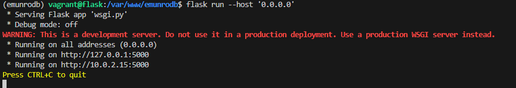
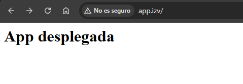

# Despliegue-de-una-aplicaci-n-Python-con-Flask-y-Gunicorn

## Descripción

Este proyecto documenta el despliegue de una aplicación web utilizando Flask y Gunicorn, con la configuración de un entorno virtual con Pipenv y el uso de Nginx como proxy inverso.

## 1. Instalación de Dependencias

Primero, actualizamos el sistema e instalamos las dependencias necesarias, incluyendo el gestor de paquetes `pip` y `pipenv` para la administración de entornos virtuales.

```bash
sudo apt-get update && sudo apt-get install -y python3-pip
pip3 install pipenv python-dotenv
```

## 2. Creación del Entorno Virtual

Creamos el directorio de la aplicación, asignamos los permisos adecuados y configuramos un entorno virtual para gestionar las dependencias del proyecto.

```bash
mkdir -p /var/www/emunrodb
sudo chown -R $USER:www-data /var/www/emunrodb
sudo chmod -R 775 /var/www/emunrodb
cd /var/www/emunrodb
pipenv shell
pipenv install flask gunicorn
```

## 3. Creación de Archivos

Generamos los archivos base para la aplicación, que incluyen el código de Flask y la configuración de WSGI.

```bash
touch application.py wsgi.py
```

## 2. Contenido de `application.py`

Creamos una aplicación Flask sencilla que responde con un mensaje cuando se accede a la raíz (`/`).

```python
from flask import Flask
app = Flask(__name__)

@app.route('/')
def index():
    return '<h1>App desplegada</h1>'
```

## 3. Contenido de `wsgi.py`

Definimos el punto de entrada para Gunicorn, encargándose de importar la aplicación y ejecutarla.

```python
from application import app
if __name__ == '__main__':
    app.run(debug=False)
```

## 4. Ejecución y Pruebas

Para probar la aplicación, podemos iniciar el servidor de desarrollo de Flask y verificar su funcionamiento.

```bash
flask run --host '0.0.0.0'
```
 



O bien, usar Gunicorn para ejecutarla en un entorno de producción.

```bash
gunicorn --workers 4 --bind 0.0.0.0:5000 wsgi:app
```

## 5. Configuración de Gunicorn con systemd

Creamos un servicio para `systemd` que permitirá gestionar Gunicorn como un proceso en segundo plano.

Crea el archivo `/etc/systemd/system/flask_app.service` con el siguiente contenido:

```ini
[Unit]
Description=flask app service - App con Flask y Gunicorn
After=network.target

[Service]
User=vagrant
Group=vagrant
Environment="PATH=/home/vagrant/.local/share/virtualenvs/vagrant-G6U0N2py/bin"
WorkingDirectory=/var/www/emunrodb
ExecStart=/home/vagrant/.local/share/virtualenvs/vagrant-G6U0N2py/bin/gunicorn --workers 3 --bind unix:/var/www/emunrodb/emunrodb.sock wsgi:app

[Install]
WantedBy=multi-user.target
```

Luego, recarga `systemd` y activa el servicio para que se inicie automáticamente.

```bash
sudo systemctl daemon-reload
sudo systemctl enable flask_app
sudo systemctl start flask_app
```

## 6. Configuración de Nginx

Nginx actuará como proxy inverso para manejar las solicitudes HTTP y dirigirlas a Gunicorn.

Crea el archivo `/etc/nginx/sites-available/emunrodb.conf`:

```nginx
server {
    listen 80;
    server_name app.izv www.app.izv;

    access_log /var/log/nginx/app.access.log;
    error_log /var/log/nginx/app.error.log;

    location / {
        include proxy_params;
        proxy_pass http://unix:/var/www/emunrodb/emunrodb.sock;
    }
}
```

Creamos un enlace simbólico para habilitar la configuración y verificamos que no haya errores antes de reiniciar Nginx.

```bash
sudo ln -s /etc/nginx/sites-available/emunrodb.conf /etc/nginx/sites-enabled/
sudo nginx -t
sudo systemctl restart nginx
```

## 7. Acceso a la Aplicación

Para acceder a la aplicación, configuramos el archivo `hosts` de la máquina anfitriona para asociar el dominio con la IP de la máquina virtual.

Asegúrate de agregar en `/etc/hosts` la siguiente línea:

```bash
192.168.57.102 app.izv www.app.izv
```

Luego, accede a la aplicación desde el navegador:

```bash
http://app.izv/
```

O tambien podrias intentar:

```bash
http://www.app.izv/
```

 

# Tarea de ampliación

### Descripción
Usando los datos y configuraciones del ejercicio anterior desplegaremos un repositorio(https://github.com/Azure-Samples/msdocs-python-flask-webapp-quickstart) utilizando Vagrant, Gunicorn y Nginx.

### 1. Clonar el Repositorio

Debemos de clonar el repositorio en la carpeta `www`.

```bash
cd /var/www/
sudo apt install git
git clone https://github.com/Azure-Samples/msdocs-python-flask-webapp-quickstart
cd msdocs-python-flask-webapp-quickstart
```

### 2. Entorno Virtual

El proyecto utiliza `pipenv` para la gestión del entorno virtual. Dentro del directorio de la aplicación:

```bash
pipenv shell
pipenv install -r requirements.txt
```

### 3. Gunicorn

Gunicorn se inicia con el siguiente comando:

```bash
gunicorn --workers 4 --bind 0.0.0.0:5000 wsgi:app
```


### 4. Nginx

Nginx se configura como proxy inverso con la siguiente configuración:

```nginx
server {
    listen 80;
    server_name app.izv www.app.izv;

    access_log /var/log/nginx/app.access.log;
    error_log /var/log/nginx/app.error.log;

    location / {
        include proxy_params;
        proxy_pass http://127.0.0.1:5000;
    }
}
```

### Una pequeña anotación.

He accedido directamente con la ip `192.168.57.102:5000`

